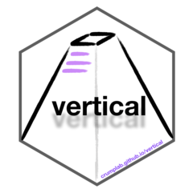
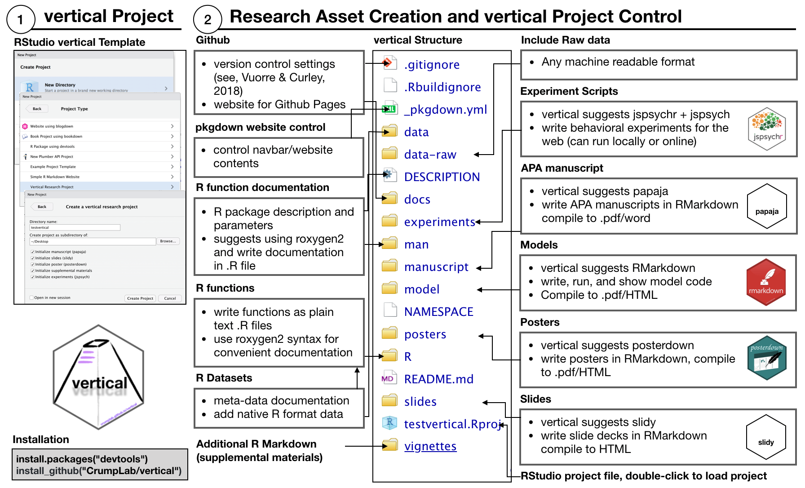

# vertical <a href='https:/crumplab.github.io/vertical'></a>

<!-- badges: start -->
[](https://www.tidyverse.org/lifecycle/#experimental)

<!-- badges: end -->

**Currently under development**

## Installation

The devtools library is required for installation:

``` r
#install.packages("devtools")
devtools::install_github("CrumpLab/vertical")
```

## Quick start

1. Install vertical (above), then restart RStudio
2. Create a new project
   - from the menu File > New Project...
   - or click the R cube in top-right hand corner, and select New Project...
3. Select the Vertical Project Template, give your vertical project a name (no spaces, only letters and numbers)
4. Create the project, then build the website by:

```
vertical::build_vertical()
```

Read the [getting started](https://crumplab.github.io/vertical/articles/vertical.html) tutorial to learn more about using `vertical`.

## What is vertical?

`vertical` is a workflow for creating, curating, and communicating research assets in psychological science in the form of a website and/or R package. `vertical` installs an RStudio project template with the `vertical` workflow structure, and compiles content in a `vertical` project to an R package and pkgdown website for sharing the assets.

### vertical workflow



### vertical website


