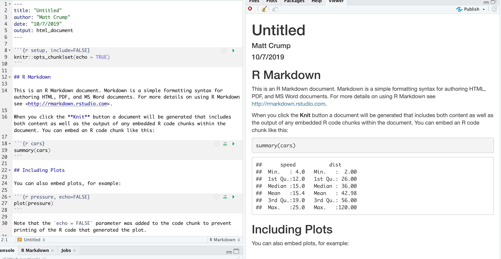

```{r setup, include=FALSE, echo=FALSE}
options(htmltools.dir.version = FALSE)
knitr::opts_chunk$set(echo = FALSE,message=FALSE,warning=FALSE, cache = TRUE)
```

# link to this website

Contains these slides and example of using R to share many components of a research project

<https://crumplab.github.io/vertical/>

---

# Online Resources for R

Lots of great and free online resources. I've been making a list:

<https://crumplab.github.io/blogposts/LearningR/LearningR.html>

---

# Everything everywhere workflow

Using lots of different programs to accomplish different jobs

1. Experiment builders (E-prime, Presentation, PsychoPy, in-house software, etc.)
2. Data Analysis (Excel, SPSS, R, Python, Matlab, etc.)
3. Write up (Word, Latex, R markdown)
4. Presentation (powerpoint, keynote)

Outcome: lots of different files everywhere, lots of work by hand, **can be very difficult to reconstruct or redo specific steps**

---

# vertical: R for everything

1. Program Experiments (exprmntr and JsPsych)
2. Data analysis (e.g., tidyverse)
3. Graphing (ggplot2)
4. Reproducible reports (R markdown)
5. Slide decks (xaringan)
6. APA papers (papaja)
7. Sharing custom functions (R packages)
8. Sharing everything all in one place (R markdown websites, Github, and pkgdown)

---

# R markdown (.Rmd files)

A text file for **notes and R scripts** that compiles to different formats (html, pdf, etc.) 

```{r}

```

---

# R Markdown guide

Definitive guide to R Markdown 

<https://bookdown.org/yihui/rmarkdown/>

---

# Experiments in R (jsPsych)

- jsPsych documentation <https://www.jspsych.org>
- xprmntr R package (in dev) <https://github.com/CrumpLab/xprmntr>
- examples <https://github.com/CrumpLab/jsPsychRexamples>

---

# Data analysis

- tidyverse <https://www.tidyverse.org> lots of great packages for data analysis
- dplyr <https://dplyr.tidyverse.org> data-wrangling
- ggplot2 <https://ggplot2.tidyverse.org> plotting

---

# Data frames

```{r, echo=TRUE}
all_data <- data.frame(trial = 1:6,
                       congruency = rep(c("con","inc"), each = 3),
                       rt = rnorm(6, mean = 0, sd = 100),
                       accuracy = c(1,1,1,1,0,1))
all_data
```

---

# dplyr - tidyverse Data Wrangling

```{r, echo=T}
library(tidyverse)
df <- all_data %>%
  filter(accuracy == 1) %>%
  group_by(congruency) %>%
  summarise(mean_rt = mean(rt))
df
```

---

# ggplot2 - tidyverse plotting

```{r, echo=TRUE, fig.height=3}
ggplot(df, aes(x=congruency, y=mean_rt))+
  geom_bar(stat="identity", position="dodge") +
  theme_classic()
```

---

# slide decks

This slide deck was written in R markdown the`xaringan` package

<https://github.com/yihui/xaringan>

---

# APA papers

`papaja` is an R package for writing APA papers in R markdown (then compile to .pdf)

<https://crsh.github.io/papaja_man/>

---

# R packages and pkgdown

`pkgdown` is an R package that builds a website for R packages.

<https://pkgdown.r-lib.org>

---

# bookdown

A package for writing books (compile to web-book, .pdf, and epub)

<https://bookdown.org>

---

# R markdown websites

Write in R markdown, and make all kinds of websites

<https://rmarkdown.rstudio.com/lesson-13.html>


