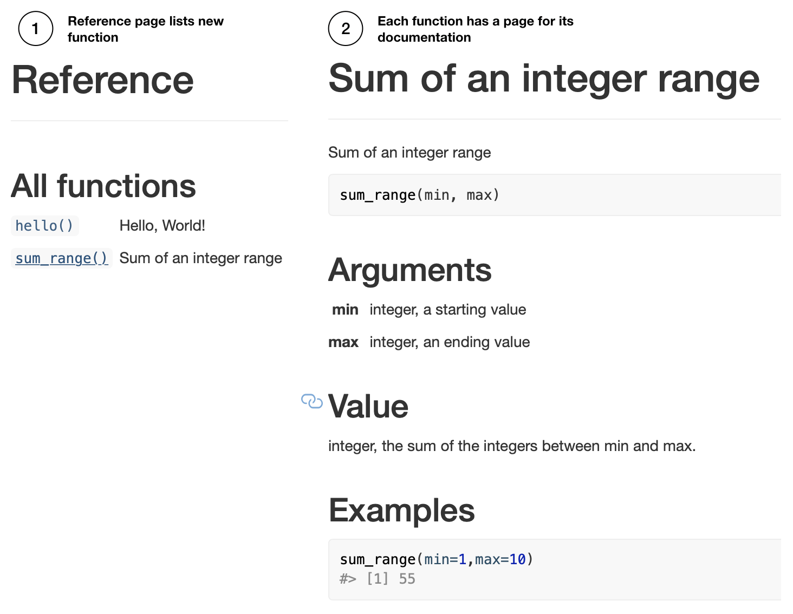

```{r, include = FALSE}
knitr::opts_chunk$set(
  collapse = TRUE,
  comment = "#>"
)
```

## Motivation

`vertical` is an R-based structured workflow for creating and sharing research assets in the form of an extended R package. There are several reasons why the R package format is useful for sharing a variety of research assets (from experiment scripts, to papers, slides and posters).

1. R packages have a standardized and well-organized file-structure that is useful for organizational purposes.
2. Researchers often develop custom functions for analysis, and putting them in an R package makes sharing the functions easy.
3. R packages can include data from a research project, and a natural way to document the data using the same schemes for documenting R functions.
4. R packages include various documents through the vignettes folder, which in principle could include various formats for communicating research, such as a manuscript or slide deck written in R Markdown.
5. R packages can be automatically rendered into websites through `pkgdown`, providing a compelling format for sharing research assets. 

## Install vertical

`vertical` requires an installation of `devtools`

```
install.packages("devtools")
```

Then, run the following to install `vertical`.

```
devtools::install_github("CrumpLab/vertical")
```

# Overview

Vertical combines the benefits of two R ecosystems for creating and sharing research project assets, these include the ecosystems of R Markdown and R packages. So vertical is:

```{r, eval=FALSE}
vertical <- RMarkdown + RPackages
```

R Markdown is a plain text document format that, 1) allows regular text to be combined with chunks of code, and 2) can be compiled to multiple output formats, such as .pdf and webpages (HTML). R Markdown offers a strategy for transparent and reproducible research because analysis scripts along with their output (e.g., results and figures), can be embedded directly in a document. R Markdown has become a large ecosystem and is capable of several forms of document creation, from journal articles, to posters and slide-decks, and much more. In general, if R Markdown is used to create a research asset, it can be included in a `vertical` project with ease. A comprehensive manual for all things R Markdown [@xie2018] is available here <https://bookdown.org/yihui/rmarkdown/>. 

R Packages are a standard for creating and sharing libraries of R functions. By default, R packages can also include data and R Markdown documents, so the format is already suitable for packaging common research assets such as functions, data, and manuscripts. R Packages are an ecosystem in that several R Packages exist to facilitate the process of creating and sharing R packages, such as [usethis](https://usethis.r-lib.org) [@usethis], [pkgdown](https://pkgdown.r-lib.org) [@pkgdown], and [devtools](https://devtools.r-lib.org) [@devtools]. Furthermore, `pkgdown` provides a method to automatically render an R package into a website that displays function documentation as well as R Markdown documents (typically tutorials for using the package). We refer readers to Wickham [-@wickham_r_2015] for an authoritative and in-depth guide on creating R packages [http://r-pkgs.had.co.nz](http://r-pkgs.had.co.nz).

`vertical` is a template for extending R Packages and pkgdown websites to include additional assets common to psychological research projects. To appreciate the extension consider the basic skeleton for building an R package that is generated by RStudio.

```{r, out.width="100%", echo=FALSE}
knitr::include_graphics("imgs/r-package-skeleton.png")
```

In the minimal example, RStudio is used to create a new project by choosing the R package template. The new project is populated with DESCRIPTION and NAMESPACE files, an R folder to write .R functions, and a man folder to write .Rd files for function documentation. RStudio automatically recognizes the project as an R package, and provides a build tab in the IDE to install the package. A pkgdown website can be built by one command `pkgdown::build_site()`.

## vertical workflow

Installing the `vertical` package adds a new project template to RStudio (RStudio should be restarted after `vertical` is installed so that it recognizes the template). Users can initiate a new vertical project from RStudio by choosing the vertical project option when creating a new project. By default a vertical project is structured in the following manner:

```{r, out.width="100%", echo=FALSE}
knitr::include_graphics("imgs/vertical-project.png")
```

The new project contains a more complete skeleton of an R package (e.g., folders for data-raw, data, and vignettes), `_pkgdown.yml` for controlling website parameters when rendered with `pkgdown`, and additional folders for research project assets such as `experiments`, `manuscript`, `model`, `posters`, and `slides`. These additional folder can simply be locations to store final products (e.g., a .zip file for experiment scripts, a .pdf for the manuscript, PowerPoint for the slides, etc.); however, each of these assets can also be created as R Markdown documents. So, by default `vertical` includes R Markdown templates from other packages within each folder for building each type of content. As a result, `vertical` suggests using R as a single-platform solution stack for research asset creation.

## vertical website

A major impetus behind `vertical` is to facilitate sharing of research assets. For example, the benefit of using a `vertical` workflow is that a website presenting all of the research assets can be automatically rendered through `pkgdown`. For example, the figure below shows a `vertical` project website, with example page content shown in the boxes.

```{r, out.width="100%", echo=FALSE}
knitr::include_graphics("imgs/vertical-website.png")
```

Once content has been created in each of the folders, or a subset of them, the website can be rendered in one call using `vertical::build_vertical()`.

Depending on the nature of the research project, a vertical website is capable of sharing several assets. At a minimum, the landing page can be used to overview the research project. The navigation bar can be used to download a .pdf of the manuscript, as well as posters and slides. Supplementary materials can be written in R markdown and displayed directly on the website. Similarly, model code and supplementary data analyses can be included directly on the website. If the project includes as a browser-based behavioral experiment, in addition to sharing the source code for the experiment, a demonstration of the experiment can be run directly from the website. Finally, because a vertical website is powered by pkgdown, the website provides pages for R functions and data documentation.

## Sharing vertical on Github and OSF

There are several methods for sharing research assets as online repositories, for example using Github or a project on the [open science framework](https://osf.io) (OSF). `vertical` is built with Github and OSF integration in mind, however a `vertical` project could in principle be shared in any repository. 

Github is very convenient for sharing `vertical` projects for several reasons:


1. R packages stored on Github repositories can be installed using `devtools`. `vertical` projects may contain R packages, so Github is useful for allowing others to install the package from their R console.
2. `pkgdown` websites assume Github integration, and compiles the website source code into the `docs` folder. The same occurs in a vertical project. Github repositories have the option to display a website through Github pages (activated in the repository settings), which serves any content in a repository `docs` folder as a static website (the URL for the website is shown in the settings page after Github pages is activated). So, Github provides a convenient and free method to share a `vertical` website.
3. RStudio supports git version control, so a `vertical` project can be created as a git repository. Users unfamiliar with the benefits of version control inherit those benefits (and/or may learn about them) by activating them in a `vertical` project.
4. Research assets in psychological science are commonly shared on OSF, which among other things provides a digital object identifier for a project, and a persistent means of storing the assets. OSF provides Github integration, allowing the content of an OSF project to be automatically populated by the content of a linked Github repository.

# Tutorial

The following tutorial on `vertical` describes the creation of a vertical project, discussion of the vertical workflow for various types of content creation, rendering a vertical project website, and sharing vertical projects on Github and OSF. We attempt simple examples in each case, and refer readers to other guides for more in depth treatment when necessary.

## Creating a vertical project

[Install vertical](#install-vertical), restart RStudio, then follow these steps to initialize a new `vertical` project. **IMPORTANT**: when you choose a name it must be [a valid R package name](http://r-pkgs.had.co.nz/package.html#naming). For example, the name must contain letters, numbers, or periods (e.g., my.name), but no periods at the end. This means no spaces, dashes or underscores.  

```{r, out.width="50%", echo=FALSE}
knitr::include_graphics("imgs/vertical-new.png")
```

You can also create a vertical project from the console, see the documentation for `init_vertical_project()` for more options.

```{r, eval=FALSE}
vertical::init_vertical_project()
```


## Default vertical template

By default, a fresh `vertical` project contains the following files and folder structure:

```{r, out.width="75%", echo=FALSE}
knitr::include_graphics("imgs/vertical-structure.png")
```

## Building the vertical website

A new `vertical` project is populated with template examples for every kind of content supported by vertical (e.g., R functions, manuscript, poster, slides, supplementary materials, and even writing a browser-based behavioral experiment with jspsych). As a result, an example vertical website (showing templated content) can be rendered immediately by running the following in the console:

```{r, eval=FALSE}
vertical::build_vertical()
```

The above line should create and output the HTML files for the website into the `docs` folder in the `vertical` template. Additionally, the resulting website should appear in a browser window for inspection. For expanded discussion on customizing the website see the [Website customization] section.

One caveat is the rendering of APA manuscripts with the `papaja` package, which requires a latex installation. More generally, when `vertical` is installed, it installs dependencies such as `papaja` and other required packages, but does not install latex (see, [APA papers with papaja]).

## R Packages

`vertical` projects can include an R package containing custom functions and data sets. This tutorial presents minimal examples for R package creation, and users interested in this functionality should consult Wickham's guide for creating R packages <http://r-pkgs.had.co.nz>.

We suggest avoiding a manual style for R package creation, which involves creating and modifying critical R package files by hand. Specifically, manual creation of files requires intimate familiarity with R standards for package development, which new users may not posses. Instead, we suggest users avail themselves of helper packages such as [usethis](https://usethis.r-lib.org), [pkgdown](https://pkgdown.r-lib.org), [devtools](https://devtools.r-lib.org), and [roxygen2](https://roxygen2.r-lib.org) for documenting functions and data. Wickham's guide provides in depth tutorials about R package creation using these tools.

To encourage the above method for R package creation, the vertical template also provides `Vertical Helper.R`, which contains example commands from the above packages for automating aspects of package creation.

## R package meta data

`vertical` creates a template for R package creation, including a DESCRIPTION file that is used to provide metadata about the R package. The default DESCRIPTION file looks something like this, and should be modified by the user to change the name, title, description and so on.

```
Package: verticaltemplate
Title: What the Package Does (One Line, Title Case)
Version: 0.0.0.9000
Authors@R: 
    person(given = "Matt",
           family = "Crump",
           role = c("aut", "cre"),
           email = "mcrump@brooklyn.cuny.edu",
           comment = c(ORCID = "0000-0002-5612-0090"))
Description: What the package does (one paragraph).
License: MIT + file LICENSE
Encoding: UTF-8
LazyData: true
Suggests: 
    rmarkdown
```

The Wickham guide discusses the role of the DESCRIPTION file in depth here: <http://r-pkgs.had.co.nz/description.html>. It is possible, through `usethis`, to set up defaults that auto-populate the DESCRIPTION with user information (for example, see [usethis setup](https://usethis.r-lib.org/articles/articles/usethis-setup.html)).

## Adding R functions

The following is an example of adding a new function to the R package in a vertical project. Some reminders of these steps are suggested in `Vertical Helper.R`.

New functions are added as .R files to the `R` folder. This can be automated by the following, which creates a new .R file inside the `R` folder, in this case with the name `myfunction.R`.

```{r, eval=FALSE}
# replace myfunction with your function name
usethis::use_r("myfunction")
```

In this example, we will write a function that sums the integers between a first and second value. To begin, we decide to name the function `sum_range`, and create the .R file by running:

```{r, eval=FALSE}
usethis::use_r("sum_range")
```

Next, the function is written in the newly created file `sum_range.R`. For example, the following is added, starting on line 1:

```{r, eval=FALSE}
sum_range <- function(min,max){
  return(sum(min:max))
}
```

We will use `roxygen2` style commenting to provide documentation for the function. The documentation will be shown in the help menu when the package is installed, allow help for the function to be accessed from the console by `?sum_range`, and produce a webpage with the documentation when rendered by `pkgdown`. The alternative to `roxygen2` is to manually write an .Rd file in the `man` folder for the new function; `roxygen2` automates this process and allows the documentation to be added as comments in the .R file defining the function.

Make sure `roxygen2` is installed (using RStudio, or `install.packages('roxygen2')` from the console.). RStudio may need to restart to recognize `roxygen2`. Before proceeding activate `roxygen2` documentation in RStudio, under Tools > Project options..., and select the check-box for roxygen documentation:

```{r, out.width="50%", echo=FALSE}
knitr::include_graphics("imgs/roxygen.png")
```

Next, a template for `roxygen2` comments can be automatically generated from within the .R file using the following steps:

```{r, out.width="100%", echo=FALSE}
knitr::include_graphics("imgs/roxygen-insert.png")
```

A guide for documenting functions with `roxygen2` is available here <http://r-pkgs.had.co.nz/man.html>. In our example, we modify the `roxygen2` skeleton like so:

```
#' Sum of an integer range
#'
#' @param min integer, a starting value
#' @param max integer, an ending value
#'
#' @return integer, the sum of the integers between min and max.
#' @export
#'
#' @examples
#' sum_range(min=1,max=10)

sum_range <- function(min,max){
  return(sum(min:max))
}
```

The last step is generate the .Rd file in the `man` folder, which is used to create the documentation. The .Rd file is generated automatically by `devtools::document()`, or by the RStudio macro `Ctrl/Cmd + Shift + D`. For example, a new `sum_range.Rd` file like the following is saved to the `man` folder. This should not be edited by hand.

```{r, out.width="50%", echo=FALSE}
knitr::include_graphics("imgs/new-rd.png")
```

## R package compilation

At this stage we have added a new R function to the R package skeleton, but have not yet compiled and installed the R package. The R package can be built and installed in one step by pressing "Install and Restart" from the Build tab in RStudio. After this step, the package is installed on the local system, it will be shown in the list of packages along with constituent function documentation. The functions in the package can be loaded using the `library()` command.

```{r, out.width="100%", echo=FALSE}
knitr::include_graphics("imgs/package-build.png")
```

Relatedly, pkgdown can be used at this point to render the function documentation to the website by `pkgdown::build_site()`.

```{r, out.width="75%", echo=FALSE}

```

## Adding Data

Arbitrary data can be included in an R Package by placing R data files into a `data` folder. Importantly, data can be documented just like a function, which allows for clear and descriptive meta-data for the data object. `vertical` does not create a `data` folder as a part of its template. This is to encourage useful strategies for data inclusion that automate the creation of the data folder when it is required.

<!--
`vertical` includes  [document_data()](https://crumplab.github.io/vertical/reference/document_data.html) quickly to add an existing dataframe to an R package. For example, if `mydf` was an existing dataframe, then the following:  

```{r, eval=FALSE}
document_data(mydf)
```

would accomplish:

1. create a `data` folder (if it didn't already exist)
2. save mydf as an .rda file to the `data` folder
3. create a mydf.R file for documentation, save it to the R file
4. add a roxygen skeleton for documentation to mydf.R
5. open mydf.R for editing
-->

The next example shows individual steps for including data from the R environment. We then discuss strategies for including data as a part of a reproducible research project. Briefly the steps are:

1. create a dataframe
2. `usethis::use_data()` adds .rda to `data` folder
3. `usethis::use_r()` adds .R to `R/` for documentation
4. `sinew::makeOxygen` generate roxygen documentation skeleton

R objects in the environment can be included as data in an R package. For example, the following generates a simple data frame in the R environment:

```{r}
mydf <- data.frame(a = 1:5,
                   b = 6:10,
                   c = c("A","B","C","D","E"))
```

The `mydf` data frame can be exported to an .Rda file and written to the `data` folder through `usethis`:

```{r, eval=FALSE}
usethis::use_data(mydf)
```

The above also creates the `data` folder if it does not already exist.

Next, documentation for the data is added by including a `data.R` file in the `R` folder. 

```{r, eval= FALSE}
usethis::use_r('data')
```

Finally, `roxygen2` comments are added to `data.R` to describe the data file. We recommend installing the `sinew` package which can generate a useful template for documenting R data objects. 

```{r, eval=FALSE}
library(sinew)
makeOxygen(mydf)
```

For example, the above generates the following template that can be copied copied to `data.R`.

```
#' @title DATASET_TITLE
#' @description DATASET_DESCRIPTION
#' @format A data frame with 5 rows and 3 variables:
#' \describe{
#'   \item{\code{a}}{integer COLUMN_DESCRIPTION}
#'   \item{\code{b}}{integer COLUMN_DESCRIPTION}
#'   \item{\code{c}}{integer COLUMN_DESCRIPTION} 
#'}
#' @details DETAILS
"mydf"
```

The template is then edited to describe the data object, such as:

```
#' @title mydf
#' @description example data frame
#' @format A data frame with 5 rows and 3 variables:
#' \describe{
#'   \item{\code{a}}{integer some numbers}
#'   \item{\code{b}}{integer some more numbers}
#'   \item{\code{c}}{character some letters} 
#'}
#' @details This dataset is an example.
"mydf"
```

Finally, the .Rd file is generated by `devtools::document()`, or by the RStudio macro `Ctrl/Cmd + Shift + D`. When the package is built it will now contain the included data and documentation for the data. The documentation will be added to the website when the site is rebuilt.

Importantly, whenever the package is loaded (e.g., `library(verticaltemplate)`), the included data becomes available just like the included functions. For example, the following would load the package, then load the included dataset to the environment.

```{r, eval=FALSE}
library(verticaltemplate)
mydf #loaded into environment from package
```

Finally, documentation for multiple data objects can be added to a `data.R` file. Insert a new line after the documentation for the first data object, then insert the roxygen comments for the next one. Or, individual data sets could be documented with individually named `.R` files. We suggest readers familiarize themselves with [sinew](https://metrumresearchgroup.github.io/sinew/), which provides very convenient functions for automating roxygen templates for documenting functions and data sets.

We have discussed the operations for adding data to an R package. In the context of including data from a research project we have a few additional suggestions. `vertical` does create a `data-raw` folder as part of the template. This is a location to place raw data in any given format that can be imported to R, such as a .csv file, excel file, JSON file, SPSS file, or other file type.

It is very often the case that raw data must be pre-processed or wrangled from its raw form to another form required by functions for data-analysis. Pre-processing steps may also involve excluding aspects of the raw data, or imputing structure to the raw data. In the spirit of sharing reproducible research it is important to record and make transparent all pre-processing steps. In principle, the transformations of data along an analysis path can be preserved in a variety of locations, such as in R Markdown documents that contain the scripts for the transformation. `vertical` suggests that the `data-raw` folder is used a location to, 1) declare and conduct pre-processing steps, and 2) save the transformed raw data to the `data` folder if the intention is to include it in the R package.

For example, the `data-raw` folder contains `DATASET.R`, a mostly blank .R script. This script can be populated with the code necessary to import the raw data and transform it as needed to a desired form for further analysis. In other words, `DATASET.R` is a script that declares pre-processing steps. The script can also include usethis commands and sinew commands to output desired R objects to the data folder, and to write documentation for these objects. One benefit to this strategy is that transformed data (ready-for-analysis), can later be accessed by loading the package as a library. For example, R Markdown assets for writing a manuscript, poster, or slide deck that include data-analysis, can quickly load the data by calling the library.

## `manuscript`: APA papers with papaja

The `manuscript` folder is for writing manuscripts. APA-style manuscripts can be written in R Markdown using the fantastic [papaja](https://crsh.github.io/papaja_man/) package [@papaja]. The linked to documentation explains how to use `papaja`, and rather than repeat that information here, we briefly extol some virtues of `papaja`.

`vertical` includes a `papaja` template in the `manuscript` folder. Knitting `manuscript.Rmd` in RStudio produces an APA-style manuscript as a .pdf. NOTE, a latex installation is required in order to knit to pdf, and see the `papaja` documentation for suggestions on installing latex (see also the `tinytex` R package which may be of some use for navigating latex installation issues). `vertical` also includes the resulting .pdf in its website as a downloadable file.

There are several benefits to using `papaja`. First, it is possible to create an entirely reproducible research manuscript. For example, all of the text and R code for data-analysis, modeling, and figure generation, can be included in the .Rmd file. Second, `papaja` includes many helpful functions (such as `apa_print()`) for automating the writing of results from an R object (e.g., the results of an ANOVA, t-test, or regression) to the manuscript. Third, `papaja` uses latex style citations which automatically create bibliographies. Finally, it is possible to export to latex and word documents (which may need some formatting by hand at the end). Finally, papaja also has convenient templates for responding to action letters during the review process.

## `posters and slides`: posterdown and slidy

The `posters` folder and `slides` folder are for writing posters and slide decks in R Markdown, which can be included as part of the `vertical` project website. Furthermore, `vertical` suggests templates for creating these assets in  R Markdown. For example, the `posters` folder includes a [posterdown](https://github.com/brentthorne/posterdown) template [@posterdown], and the `slides` folder includes a [slidy](https://bookdown.org/yihui/rmarkdown/slidy-presentation.html) template. Both produce browser-displayable content that can be included in the `vertical` website. The respective links point to documentation for making posters with posterdown and making slide decks with slidy. Additionally, the posters and slides folders can be populated with other templates (by the user) if other packages are preferred for making posters and slides in R markdown.

## `vignettes`: Supplementary materials, model code, and arbitrary R Markdown

Research assets can take many forms beyond a manuscript, poster, or slide deck, and may include stimulus materials, supplementary data analyses, and model simulations. `vertical` does not suggest folders each of these additional assets, however it does such a strategy for organizing and creating these kinds of assets it the `vignettes` folder. The strategy is to add R Markdown documents to the `vignettes` folder and/or add sub-folders for different classes of documents to the `vignettes` folder, and populate those with R Markdown documents as needed.

The `vignettes` folder is part of the R package structure, and typically used to include tutorial documentation inside an R package. For example, clicking an R package in the RStudio packages tab will show a link to vignettes if they exist in the package, and they can be read directly in the help window from R studio. 

```{r, out.width="100%", echo=FALSE}
knitr::include_graphics("imgs/vignettes.png")
```

Vignettes are written as R Markdown documents so they can include text and R code chunks and are suitable for communicating a wide variety of supplementary materials, such as additional analyses and model simulations, in a reproducible and transparent manner. By default, `pkgdown` also knits all of the .Rmd files in the `vignettes` folder and any sub-folders, and includes them in the `pkgdown` website under the default "articles" tab. `vertical` inherits this functionality, but renames the "articles" tab as a "Supplementary" tab. As a result, any .Rmd files in the `vignettes` folder of a `vertical` project will be compiled (on `vertical::build_vertical()`), and added to the `vertical` website. This is a convenient method for automating the addition of content to the website.

One caveat to using vignettes through pkgdown is that they are all compiled with a consistent look-and-feel imposed by pkgdown, which sets an aim to standardize documentation for R packages (the primary use case for pkgdown). Standard vignette style should be suitable for most users, and we note that it is certainly possible to use custom styles; however, a tutorial on full customization is beyond our scope (but see, further options for customization in the [Website customization] section.)

## `experiments`: jspsych and jspsychr

Depending on the needs of the research project, it is also possible to create browser-ready behavioral experiments in RStudio. For example, `vertical` creates an `experiments` folder that contains a template for building experiments using the [jspsych](https://www.jspsych.org) JavaScript library [@de2015jspsych]. Currently, `vertical` makes two suggestions. First, when a `vertical` project is created, it downloads the newest version of the jspsych library to the experiments folder. `vertical` also suggests a [jspsychr](https://crumplab.github.io/jspsychr/) template. `jspsychr` is an R package that provides templates and examples for writing `jspsych` experiments in RStudio, using a combination of R Markdown and JavaScript. The `vertical` template example includes a basic Stroop task. For example, knitting the `index.Rmd` file produces the `index.html` file which can be run in a browser. In this case, because the experiment file is also an HTML file, it is possible to include a demonstration of running the experiment in the `vertical` website.

## Website customization overview

`vertical` is a minor extension to the `pkgdown` approach for rendering R package websites from an R package file structure. `pkgdown` places constraints on the websites it generates (around the style of content presentation), and these constraints are inherited in `vertical` websites. Some examples of current constraints are:

1. R Markdown documents placed in the vignettes folder are rendered in a style dictated by `pkgdown`. This allows consistent style across R package vignettes, and vertical inherits this style for any .Rmds in the vignettes folder.

2. The website contains a sidebar with information about "developers", as developers is a good name for authors of R packages. Unfortunately, this descriptor is hard-coded by pkgdown, so the html file would need to be edited by hand to include a different descriptor.

The benefits of adopting the `pkgdown` framework are that websites can be compiled in one command and are produced with consistent structure. In our view, the additions that vertical makes are reasonable add-ons to that structure. It is worth pointing out that all of the constraints imposed by pkgdown can be escaped by building a custom R markdown website, however `vertical` does not provide direction for that option.

Although `pkgdown` has constraints it is also fairly flexible. By default, `pkgdown` creates a simple website with a landing page (to describe the package), an articles tab to display vignettes, and a reference tab to display function documentation. For an in-depth guide to customizing pkgdown websites, see the [pkgdown documentation](https://pkgdown.r-lib.org). `vertical` extends the basic website by modifying the tabs in the navigation bar, and pointing them to assets in vertical, such as those contained in manuscript, slides, posters, etc.

Before describing some examples of customizing a `vertical` website, it may be helpful to provide an overview of the website building process. An advantage of the `pkgdown`/`vertical` approach is that users can produce a website for their project without expertise in coding for the web. The disadvantage is that general knowledge about web coding is useful for customizing the website directly, and customizing through pkgdown options.

Under the hood, `pkgdown` renders R Package assets in the form of HTML documents and exports them to the `docs` folder. The `docs` folder is included both as a location to store the web files, and with Github pages integration in mind. As we describe in the next section, Github repositories containing a `docs` folder can serve any content in `docs` folder to the web at large. We note here that the website files in the `docs` could be copied to any web server for hosting the website.

A `pkgdown` website is simply the collection of files in the `docs` folder. For example, `pkgdown` creates an `index.html` file containing the HTML necessary to show the landing page on the website. When a browser arrives at a URL location on the web (e.g., such as <https://crumplab.github.io/vertical>) it automatically attempts to load the 'index.html' file (e.g., the browser interprets <https://crumplab.github.io/vertical> as <https://crumplab.github.io/vertical/index.html>). An inspection of the `docs` folder will show several other files and folders, typically these are .html files for individual pages on the website. However, even files that are not .html files can be included for download from the website. For example, `manuscript/manuscript.pdf` is a pdf in the manuscript folder that can be downloaded from the website. 

It is worth realizing that any file in `docs` could be accessed and downloaded by a browser, even if the website does not provide a link to it. In the template, `vertical` assumes that users would want to share `manuscript.pdf`, so a tab in the website navigation bar is created such that clicking the tab initiates a download of the file. The `manuscript` folder also contains `manuscript.tex`, which is a latex version of the manuscript; however, `vertical` does not by default create a link on the website to this file. Nevertheless, if someone accessed the appropriate URL specifying the path to the file on the server (e.g., `https://site.com/projectname/manuscript/manuscript.tex`), then file would be downloaded. We mention these features of the `docs` folder to foster general intuitions about customizing the website, these are:

1. Anything in the `docs` folder can be served to the web
2. Some link should be added somewhere to a `vertical` website to connect to the content.
3. Any manual edits to the .html files in a `docs` folder will change the resulting website. Manual edits may need to be redone if the site rebuilt (resulting in overwriting the previous HTML) at a future point in time.

One final point about `pkgdown` is how it handles `vignettes`. Vignettes are simple R Markdown documents in the `vignettes` folder. A vignette can be knitted in R Studio, and the result is an .html file rendered to the `vignettes` folder. This .html file is not served to the web because it is not in the `docs` folder. Moreover, this .html file displays the vignette as a basic, standalone webpage, that is not embedded into the pkgdown website. For example, the navigation bar for the website is not included. This process is different from using `pkgdown::build_site()`, which renders the .Rmd files in `vignettes` to the `docs` folder, and in the process adds the overarching website html to each vignette so that they include website features such as the navigation bar.

We mention the above issues to expose the process of including additional content to the website. `vertical` takes care of some of the additions automatically through `vertical::build_vertical()`. For example, `vertical::build_vertical()` compiles .Rmd files in the manuscript, posters, and slides folders, exports the assets to the `docs` folder, and adds links to the content in the navbar. Presently, there is limited functionality in `vertical` for automating the inclusion of arbitrary content in arbitrary folders. For example, if a user created a `blog` folder containing an R markdown that rendered to HTML in a particular style, it would not be included by default. Importantly, such arbitrary content can be included manually, with the caveat that aspects of the vertical website may not be included. For example, the blog page could be linked to from the navigation bar, but clicking the link would display the single page as is, and without the vertical website structure (e.g., the navigation bar would be missing).

## Website customization

The `_pkgdown.yml` file is used to customize many aspects of the website. The `vertical` template creates `_pkgdown.yml` which defines the appearance and order of navigation tabs and how they link to vertical assets. By default, `vertical::build_vertical()` automatically updates `_pkgdown.yml` to include tabs and menu items in each tab for the following vertical assets: manuscript, posters, slides, and vignettes. Specifically, the titles of .Rmd documents in those folders are added as menu items to their respective tabs. If the `vignettes` folder contains sub folders, then the name of the sub-folder is used as section header in the "Supplementary" tab, and the title of .Rmds in each sub-folder are listed as menu items under their respective sections.

Below is example yml for controlling the navigation tabs. The `structure` section defines the ordering and placement of tabs in the navbar. For example, home, manuscript, articles, slides, posters, experiments, and reference tabs are all left-aligned, and the source code link to Github is right aligned. Switching the order of the component listed under structure will change the order of the tab in the navbar.

Next is the list of components, which form individual tabs. The name of the component does not need to be the same as the text displayed in the tab. For example the manuscript component specifies its text attribute as "APA6 PDF", which is the text shown in the manuscript tab.

```
navbar:
  structure:
    left:
    - home
    - manuscript
    - articles
    - slides
    - posters
    - experiments
    - reference
    right: github
  components:
    home:
      icon: fa-home fa-lg
      href: index.html
    manuscript:
      text: Manuscript
      menu:
      - text: APA6 PDF
        href: manuscript/manuscript.pdf
    articles:
      text: Supplementary
      menu:
      - text: Getting Started
        href: articles/Supplemental_1.html
    slides:
      text: Slides
      menu:
      - text: R Markdown slides
        href: slides/slides.html
    posters:
      text: Posters
      menu:
      - text: Conference 2019
        href: posters/poster.html
    experiments:
      text: Experiments
      menu:
      - text: Experiment 1
        href: experiments/experiment-1/index.html
    reference:
      text: Functions
      href: reference/index.html
    github:
      text: source code
      icon: fa-lg fa-github
      href: https://github.com/CrumpLab/vertical_template
```

Of special note is the articles component, which appears as a tab named "Supplementary". Any .Rmds in the `vignettes` folder are linked under this tab. The order and appearance of the links in the tab can be edited for clarity. For example, imagine `vignettes` folder had two sub-folders, `analyses`, and `model`, that included .Rmds for different analyses and model simulations. The above yml could be modified to structure the ordering and sectioning of items in the tab like so:

```
    articles:
      text: Supplementary
      menu:
      - text: Additional Analyses
      - text: Experiment 1
        href: articles/analyses/data_1.html
      - text: Experiment 2
        href: articles/analyses/data_2.html
      - text: Model simulations
      - text: Simulation 1
        href: articles/model/sim_1.html
      - text: Simulation 2
        href: articles/model/sim_2.html
```

A new tab with any name can be added to the website by adding a new component to the yml file. At a minimum, the new component should specify a text attribute, which will be the name of the tab, and an href attribute, which refers to the location of the linked asset. 

Last, the home portion of the yml controls information displayed on the right side bar of the landing page. For example, links could be replaced with links to an OSF repository, or a journal website with a published version of a paper.

```      
home:
  strip_header: true
  links:
    - text: A link to X
      href: some link
    - text: A link to Y
      href: another link
  Authors:
    - text: Author 1
    - text: Author 2
```

## Sharing a vertical project

`vertical` was created assuming [Github](https://github.com) and [open science framework](https://osf.io) (OSF) integration, which are both free ways to share a repository online. The open science framework is commonly used in psychological science to research assets, and it allows Github integration. For example, rather than uploading files to OSF manually, an OSF project can be pointed at a Github repository, which then populates the OSF project. OSF projects also provide digital object identifiers (DOI). So, to share a `vertical` project the major step is to copy a local `vertical` project to a repository on Github.com.

Github is a website for sharing repositories of code in a git format. Git is version control software that has many capabilities beyond the scope of this tutorial. By default, `vertical` creates a new project as a git repository, which makes it easy to upload (push) to Github. The following steps should be sufficient to share a vertical project on Github.


1. Sign up for a free account on Github.
2. There are lots of tools for using git and Github. For example, you could use RStudio for many of your needs. We suggest [downloading the Github Desktop application](https://desktop.github.com) (also free), which provides a simple point-and-click interface.
3. When your vertical project is ready for Github (e.g., it has been compiled, and the website loads as you would like it on your local computer), the remaining step is to push your local project to Github. You can do this easily with Github Desktop.
  - Open Github Desktop
  - Associate Github Desktop with your Github account in preferences
  - Choose the option to add a new repository
  - Navigate to the folder containing your vertical project, and add it
  - Choose the option to publish the repository on Github
  - Make sure the repository is not set to Private, otherwise you won't be able to share it (alternatively, you private repositories are also possible)
  - Publish the repository
4. To view the repository on Github, you can press the view on Github button from Github Desktop. 
5. You should now see your new repository on Github.
6. To enable the website, go to the settings for the repository. Scroll down and activate the Github Pages option, choosing the "docs" option. Wait a few seconds, and navigate to the URL which should be displayed above the Github Pages section.
7. If everything worked properly, you should be viewing your vertical project website live on the web.

Once your Github repository is uploaded, you can head over to OSF to associate your repository with an OSF project.

If your vertical project contains an R package, then it can now be installed from Github. You might suggest the following on the landing page or readme file to give instruction on installing the package:

```
# Install the package by
install.packages("devtools")
devtools::install_github("githubuser/reponame")
```

In the above, your would replace "githubuser" with your Github username, and "reponame" with the name of your Github repository containing the R package.


# References


